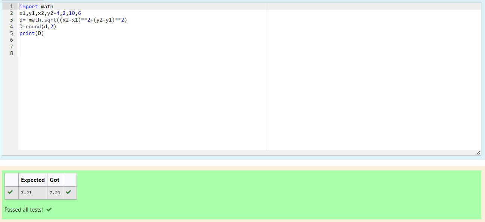

# DISTANCE-BETWEEN-TWO-POINTS

## AIM:
To write a python program to find the distance two 2 points
## ALGORITHM:
### Step 1:
start the program
### Step 2:
import math module
### Step 3: 
Substitute the values in the distance formula  
### Step 4: 
round of up to two decimal
### Step 5:
print the round of value
### PROGRAM:
```
#program to Distance between two points
#Developed by : VARNIKA.P
#Register no : 23008344
import math
x1,y1,x2,y2=4,2,10,6
d= math.sqrt((x2-x1)**2+(y2-y1)**2)
D=round(d,2)
print(D)
```


### OUTPUT:



### RESULT:
Thus rounding of value is successfully executed
